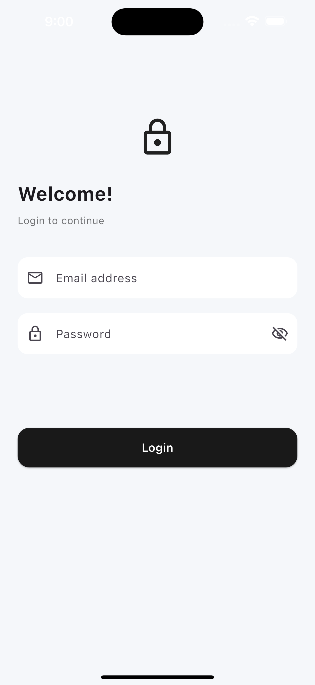
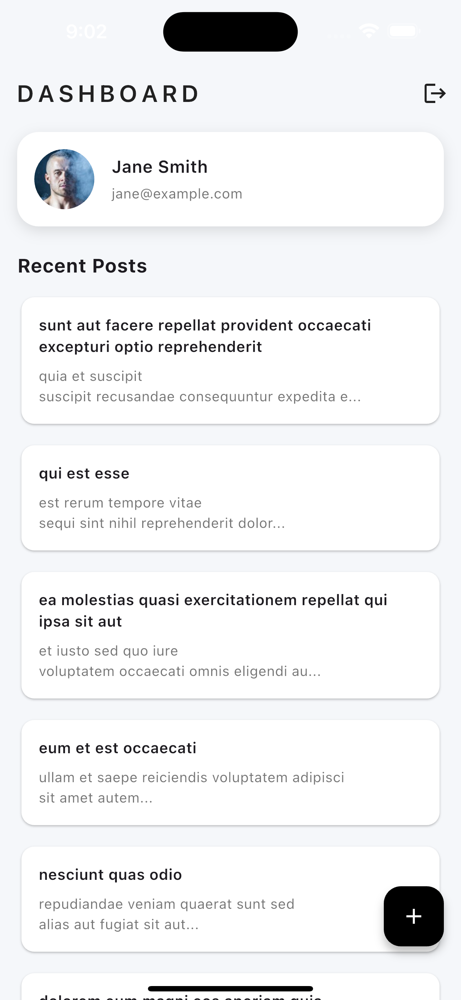
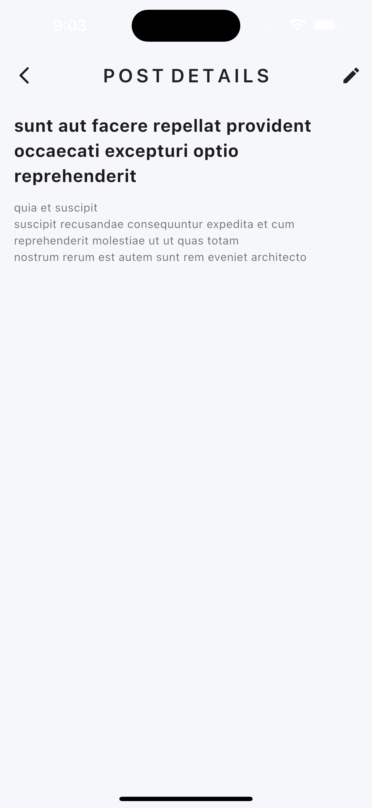
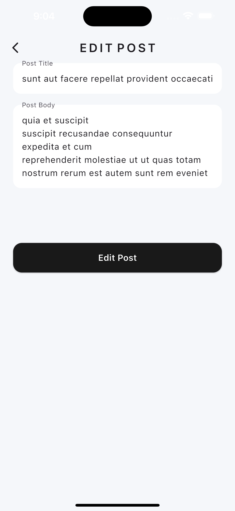
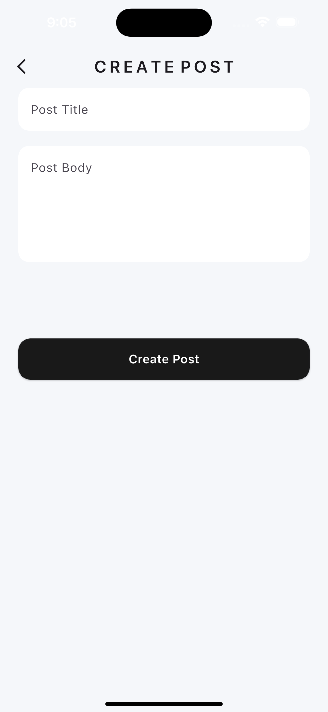

# cdlp_test_app

## 📱 App Overview
**cdlp_test_app** is a Flutter mobile application built as an interview assessment for **CDLP**.  
The app demonstrates API consumption, authentication flow, clean architecture, and state management best practices using Flutter.

The application integrates with a public REST API to display a list of posts, supports viewing detailed information, and allows creating and updating posts. A mock authentication flow is implemented with persisted login state.

> ⚠️ This project is intended strictly as a technical assessment and not as a production application.

### Key Features
- Mock authentication (login & logout)
- Persistent login state
- Dashboard displaying posts fetched from a REST API
- View post details
- Create new posts
- Edit existing posts
- Loading, error, and empty states
- Clean architecture with clear separation of concerns

---

## 🛠 Tech Stack

- **Flutter:** 3.38.6 (latest stable at time of development)
- **Dart:** 3.10.7
- **State Management:** Provider + ChangeNotifier
- **Architecture Pattern:** MVVM
- **Networking:** Dio
- **API:** [JSONPlaceholder](https://jsonplaceholder.typicode.com)
- **Platforms:** Android, iOS

---

## 🧱 App Architecture

The app follows the **MVVM (Model–View–ViewModel)** architecture combined with **Provider** for state management.

### Why Provider + MVVM?
- Keeps UI widgets free of business logic
- Encourages separation of concerns
- Simple, lightweight, and well-suited for medium-sized apps
- Easy to reason about state changes via `ChangeNotifier`
- Improves testability and maintainability

### Folder Structure

lib/
- _core_/
  - app_widgets/
  - logger/
  - models/
  - repositories/
  - services/
  - utils/ 
- screens/
  - dashboard/
    - view/
    - view_model/
    - widgets/  
  - login/
  - post_form/
  - startup/ 
- dependencies.dart
- main.dart


---

## 🔐 Authentication

- Email & password login
- Input validation
- Authentication is **simulated**
- Allowed credentials are hardcoded for demo purposes
  - email: "john@example.com" password: "password123"
  - email: "jane@example.com" password: "qwerty"
  - email: "test@demo.com" password: "123456"
- Login state is persisted locally
- Users can log out and re-authenticate

---

## 📊 Dashboard

After authentication, users are presented with a dashboard containing:
- Profile summary of the logged in user.
- List of posts fetched from the API.

Each post displays:
- The post title.
- The first 60 characters of the post body.
---

## 📄 Details Screen

- View full post details.
- Features an edit button that takes the user to the [Edit Post] screen.

---

## ✏️ Create & Update Posts

- Create new posts.
- Edit existing posts.
- Input validation.
- Changes take effect instantly.

---

## 📷 Screenshots

Screenshots are stored in the `screenshots/` directory.

| Login | Dashboard |
|------|-----------|
|  |  |

| Details | Edit | Create |
|--------|------|--------|
|  |  |  |

---

## 🚀 Setup Instructions

### Prerequisites
- Flutter SDK **>= 3.38.6**
- Dart SDK **>= 3.10.7**

### Steps
```bash
flutter pub get
flutter run
```

---
📦 API Reference

Base URL: https://jsonplaceholder.typicode.com

Used endpoints: /posts

---
📌 Purpose

This project was built as part of an interview assessment to demonstrate:

- Flutter fundamentals

- State management

- Clean architecture

- API integration

- UI/UX structure

- Code organization and readability

---
👨‍💻 Author

Samuel Ibitowa
